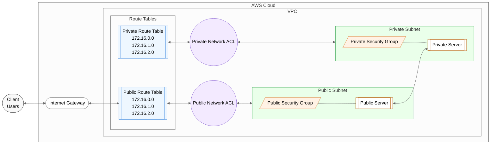

# AWS VPC Terraform Configuration

This Terraform configuration creates a complete VPC infrastructure in AWS with both public and private subnets, including EC2 instances, security groups, and network configurations.

## Infrastructure Components

- **VPC**: A custom VPC with specified CIDR block
- **Subnets**:
  - Public subnet with internet access
  - Private subnet for internal resources
- **Networking**:
  - Internet Gateway for public access
  - Route Tables for both public and private subnets
  - Network ACLs for additional security
- **Security**:
  - Public Security Group for internet-facing resources
  - Private Security Group for internal resources
- **Compute**:
  - Public EC2 instance in the public subnet
  - Private EC2 instance in the private subnet

## Prerequisites

- AWS CLI configured with appropriate credentials
- Terraform installed (version >= 1.0.0)
- SSH key pair for EC2 instances

## Usage

1. Initialize Terraform:
   ```bash
   terraform init
   ```

2. Review the configuration:
   ```bash
   terraform plan
   ```

3. Apply the configuration:
   ```bash
   terraform apply
   ```

## Configuration Variables

The following variables can be customized in `variables.tf` or through the command line:

- `region`: AWS region to deploy resources (default: "ap-southeast-1")
- `vpc_cidr`: CIDR block for VPC (default: "10.0.0.0/16")
- `public_subnet_cidr`: CIDR for public subnet (default: "10.0.0.0/24")
- `private_subnet_cidr`: CIDR for private subnet (default: "10.0.1.0/24")
- `resource_prefix`: Prefix for resource names (default: "NextWork")
- `instance_type`: EC2 instance type (default: "t3.micro")


## Architecture



## Security

- Public subnet allows inbound HTTP traffic (port 80)
- Private subnet instances can only be accessed from the public subnet
- Network ACLs provide additional network security
- Security groups control instance-level access

## Cleanup

To remove all created resources:
```bash
terraform destroy
```

## Notes

- Make sure to have appropriate AWS credentials configured
- Review security group rules before deploying to production
- Costs will be incurred for the created AWS resources
- Consider adding additional security measures for production use

## File Structure

```
.
├── README.md          # This documentation
├── main.tf           # Main Terraform configuration
├── variables.tf      # Variable definitions
```